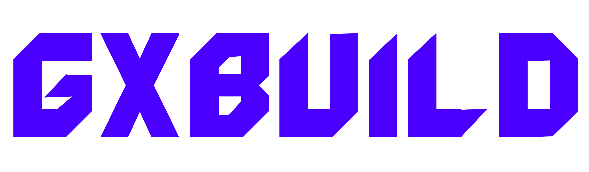

# gxBuild

>[!CAUTION]
> * gxBuild is **UNSTABLE**!
> * The app is still **UNTESTED** against real consoles!
> * There is a **99.99%** chance you will brick your console!



gxBuild is a Xbox 360 image builder and patcher. Features full nand, xell and shadowboot parsing, patching and building. Stays as close to xeBuild as possible, with a few changes. 

Based on [x360utils](https://github.com/Swizzy/x360Utils), [xenon-bltool](https://github.com/InvoxiPlayGames/xenon-bltool), and [RGBuildPP](https://github.com/emoose/RGBuildPP). Releases are licensed under the GPL v2 (inherited from xenon-bltool).

## Features

| Feature | gxBuild | xeBuild | RGBuild |
| ------- | ------- | ------- | ------- |
| Retail | ✅ | ✅ | ❌ |
| Devkit | ✅ | ✅ | ❌ |
| DevGL | ✅ | ✅ | ❌ |
| RGLoader | ✅ | ❌ | ✅ |
| XDKBuild | ✅ | - | ❌ |
| Glitch3 | ✅ | ❌ | ❌ |
| SMC Patcher | ✅ | ❌ | ❌ |
| KV Patcher | ✅ | ✅ | ✅ |
| RGLP | - | ❌ | ✅ |
| API | ✅ | ❌ | ❌ |
| Wireless | ❌ | ✅ | ❌ |
| UI Editor | ✅ | ❌ | ✅ |

## Documentation

Coming Soon

## Info

- [CREDITS.md](docs/CREDITS.md) - Project Credits
- [CONTRIBUTING.md](docs/CONTRIBUTING.md) - Contribution Guidelines
- [CHANGELOG.md](docs/CHANGELOG.md) - Changelog

## Testing

✓ = Tested Working

- = Builds correctly

× = Does not built correctly


| Platform | Retail Single | Retail Split | ArgonData | AudClamp | RJTAG | Glitch1 | Glitch2 | Glitch3 | Glitch2.3 | XDKBuild | RGBuild |
| --- | --- | --- | --- | --- | --- | --- | --- | --- | --- | --- | --- | 
| Xenon |  |  |  |  |  |  |  |  |  |  |  |
| Zephyr |  |  |  |  |  |  |  |  |  |  |  |
| Falcon |  |  |  |  |  |  |  |  |  |  |  |
| Jasper |  |  |  |  |  |  |  |  |  |  |  |
| Jasper BB |  |  |  |  |  |  |  |  |  |  |  |
| Trinity |  |  |  |  |  |  |  |  |  |  |  |
| Trinity BB |  |  |  |  |  |  |  |  |  |  |  |
| Corona |  |  |  |  |  |  |  |  |  |  |  |
| Corona 4G |  |  |  |  |  |  |  |  |  |  |  |

## Developer

In every folder ive included a README explaining the files and submodules.

The project is fully setup with [Interoptopus](https://github.com/ralfbiedert/interoptopus) for ffi bindings with C# and C.

### Building

Build gxBuild default (FFI Only)

```bash
cargo build --release
```

Build gxBuild with CLI

```bash
cargo build --release --features cli
```

## License

gxBuild is multi-licensed, distributed under the GPL v2.

Original code by ExposureMG is for the public domain.
x360utils is licensed under the unlicense (Permissive).
xenon-bltool is licensed under the GPL v2.
libmspack is relicensed as GPL v2.
ExCrypt is licensed under the BSD 3-Clause License.
Xenia is licensed under the BSD 3-Clause License.

All code taken from other projects has been properly attributed in the header.
